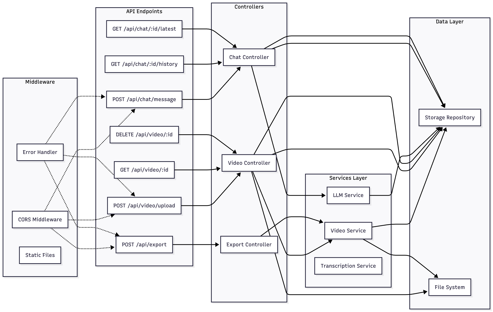
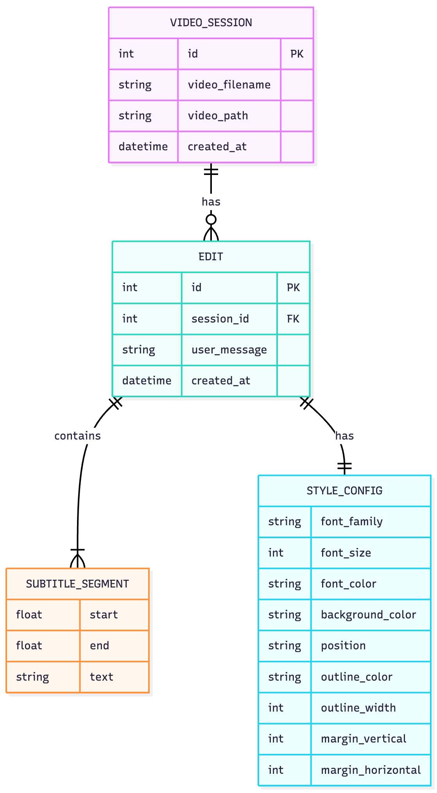
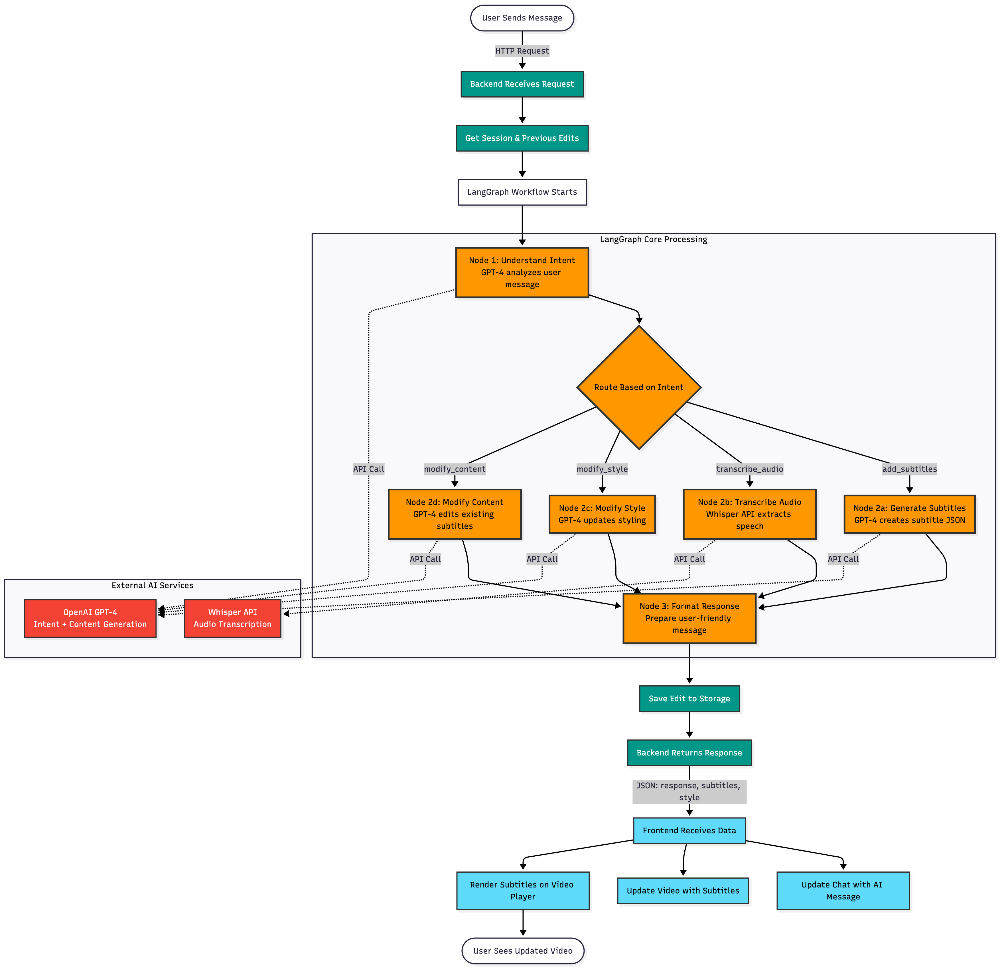
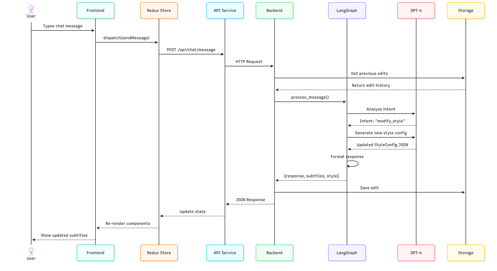
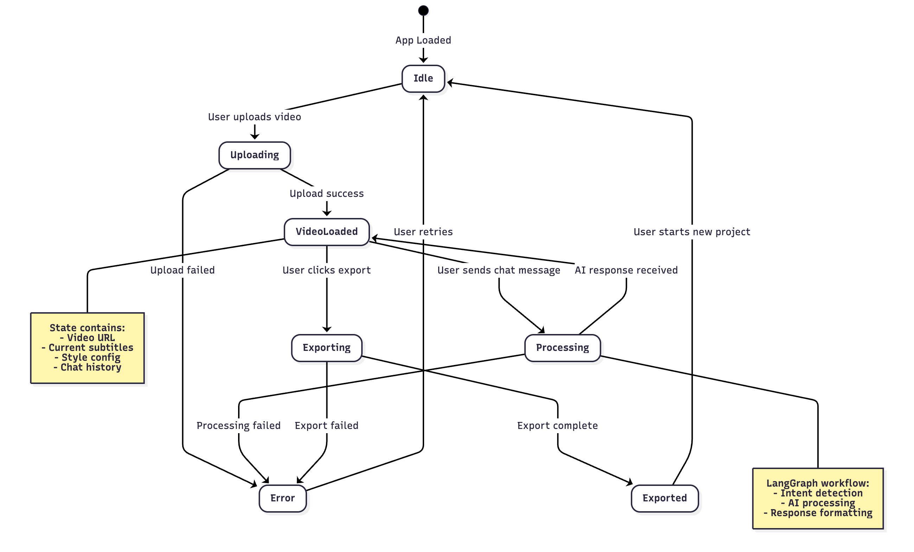

# Videoable

AI-powered chat-based video editing application.

## Documentation

### System Architecture


Comprehensive overview of the application's architecture including frontend, backend, and external services.

### API Architecture



Backend API structure showing controllers, services, repositories, and data flow.

### Data Model



Database schema and entity relationships for sessions, videos, edits, and chat history.

### Process Flow



End-to-end workflow from video upload through chat-based editing to final export.

### Sequence Diagram



Detailed interaction sequence between frontend, backend, and external services during editing operations.

### State Management



Application state management architecture and data flow patterns.

## Tech Stack

**Backend**

- FastAPI (Python)
- OpenAI GPT-4
- FFmpeg (video processing)
- Whisper (transcription)

**Frontend**

- React 19
- TypeScript
- Vite

## Quick Start

### Backend Setup

```bash
cd backend

# Create virtual environment
python3 -m venv venv
source venv/bin/activate  # On Windows: venv\Scripts\activate

# Install dependencies
pip install -r requirements.txt

# Run server
python -m uvicorn app.main:app --reload
```

Backend runs on `http://localhost:8000`

API Docs: `http://localhost:8000/docs`

### Frontend Setup

```bash
cd frontend

# Install dependencies
npm install
# or
bun install

# Run dev server
npm run dev
# or
bun dev
```

Frontend runs on `http://localhost:5173`

## Project Structure

```
videoable/
├── backend/           # FastAPI application
│   ├── app/
│   │   ├── controllers/    # API route handlers
│   │   ├── services/       # Business logic
│   │   ├── models/         # Data models
│   │   ├── repositories/   # Data persistence
│   │   └── prompts/        # LLM prompts
│   ├── data/          # JSON storage
│   ├── uploads/       # Uploaded videos
│   └── outputs/       # Processed videos
│
├── frontend/          # React application
│   └── src/
│
└── docs/             # Architecture documentation
```

## API Endpoints

**Video Management**

- `POST /api/video/upload` - Upload video
- `GET /api/video/{session_id}` - Get video details
- `GET /api/video/{session_id}/transcript` - Get transcript

**Chat & Editing**

- `POST /api/chat/session` - Create session
- `POST /api/chat/{session_id}/message` - Send chat message
- `GET /api/chat/{session_id}/history` - Get chat history

**Export**

- `POST /api/export/{session_id}/render` - Render edited video
- `GET /api/export/{session_id}/status` - Get render status
- `GET /api/export/{session_id}/download` - Download video

## Features

- Video upload and transcription
- Natural language editing commands
- AI-powered edit suggestions
- Real-time preview
- Timeline-based editing
- Subtitle generation and customization
- Video export and download

## Environment Variables

Create `.env` file in backend directory:

```env
OPENAI_API_KEY=your_api_key_here
API_HOST=0.0.0.0
API_PORT=8000
CORS_ORIGINS=["http://localhost:5173"]
```
